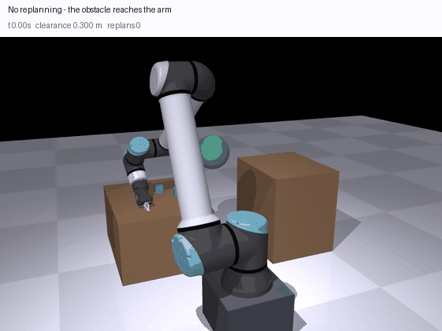
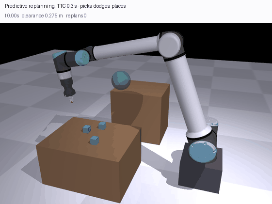

# reactive_replanning_ur12e

Reactive motion replanning for a UR12e + Robotiq Hand-E using a RealSense D435i for live obstacle detection. Built on ROS 2 Jazzy and MoveIt 2.

The arm runs a pick-and-place demo and routes around obstacles seen by the depth camera in real time. If a hand or other object enters the planned path mid-motion, the controller cancels cleanly, waits for the arm to settle, and re-plans from the current state.

## What's in here

```
launch/reactive_replanning_full.launch.py   # full stack: bringup + MoveIt + RViz + scene
config/reactive_replanning.rviz             # auto-loaded RViz with PointCloud2 + EEF path
config/sensors_3d.yaml                      # OctoMap point-cloud updater config
config/tuning.yaml                          # every parameter the node reads, with its default
reactive_replanning_ur12e/
  reactive_replanning.py                    # main detection + replanning node
  scene_setup.py                            # static collision objects (floor)
  insert_obstacle.py                        # CLI helper to drop a sphere mid-demo
```

## Detection pipeline

Each cloud frame from `/camera/camera/depth/color/points` is filtered in this order:

1. **Depth filter** in camera frame (`DEPTH_MIN`–`DEPTH_MAX` meters)
2. **Batch TF transform** to `base_link` using a single rotation matrix multiply
3. **Workspace bounding box** in `base_link` — drops floor, walls, robot pedestal, anything outside the working volume
4. **Color filter** — drops UR12e's palette (light gray / off-white housing, black accents, light-blue/teal trim) with a Kovac-rule skin protection so hands never get filtered
5. **Multi-link robot self-filter** — line-segment distance to every link shaft + joint-origin spheres + tool0 gripper guard, all dilated across the last 3 frames of arm motion (kills phantoms from points that get unmasked when the arm moves past)

Whatever survives is foreign. Centroid → published as a `CollisionObject` sphere on `/apply_planning_scene` so MoveIt can plan around it.

## Replanning strategy

Primary: `MoveGroup` action with pose constraints + `replan=True`, using **BITstar** (asymptotically optimal OMPL planner) with a 2.5 s budget for smooth, near-optimal paths.

During execution a monitor runs at 10 Hz:
- Reads `tool0` from TF (no FK service call)
- If the obstacle has *moved* since plan time AND any upcoming waypoint is within `SPHERE_RADIUS + PATH_CLEARANCE` of it, preempts the goal
- Cancels cleanly, polls joint velocities until the arm is at rest, then recursively replans from the new state (capped at depth 2)

Fallback chain when the primary plan can't be found:
1. `MoveGroup` retry after clearing the sphere (handles `START_STATE_IN_COLLISION`)
2. **IK redundancy**: ~120 IK solutions, sorted by joint distance from current state, plan up to 8 candidates and execute the shortest under the trajectory-length cap. Uses RRTConnect for speed.
3. Arc detour (cartesian over the obstacle) as last resort

## Visualization

The launch file points RViz at `config/reactive_replanning.rviz`, which loads on startup with:

- **RobotModel** — live joint state
- **PointCloud2** — `/camera/camera/depth/color/points` (Best Effort QoS so it actually displays)
- **PlannedEEFPath** — `nav_msgs/Path` republish of MoveIt's `/display_planned_path`, drawn as a green line tracing the tool0 path
- **Trajectory** — animated robot ghost following the planned trajectory with a trail
- **MotionPlanning** — full MoveIt panel for manual planning

The path republisher subscribes to `/display_planned_path`, FKs each subsampled waypoint to get tool0, and publishes on `/planned_eef_path`. Skipped during IK redundancy to avoid choking the FK service queue.

## Running

Three terminals.

**T1 — full stack:**
```bash
ros2 launch reactive_replanning_ur12e reactive_replanning_full.launch.py
```

**T2 — RealSense camera with point cloud:**
```bash
ros2 launch realsense2_camera rs_launch.py pointcloud.enable:=true
```

**T3 — the demo:**
```bash
ros2 run reactive_replanning_ur12e reactive_replanning
```

When prompted, press ENTER to start the cycles. Move your hand into the workspace at any time to trigger detection and a replan.

## Tuning

Everything is a ROS parameter. `config/tuning.yaml` carries the defaults and is
loaded by the launch file; the node runs identically without it, because the
class attributes it mirrors are the same values.

```bash
ros2 launch reactive_replanning_ur12e reactive_replanning.launch.py \
  params_file:=/path/to/my_cell.yaml

# or override one thing without a file
ros2 run reactive_replanning_ur12e reactive_replanning \
  --ros-args -p preempt_dist:=0.28 -p ws_z_min:=0.05
```

The pick and place poses are not coordinates. `compute_home_fk()` asks MoveIt
for the EEF pose at `HOME_JOINTS` and `_build_poses()` offsets it, so they
follow the robot rather than assuming where it is bolted down.

| Group | Parameters | What it controls |
|---|---|---|
| Task | `pick_z_offset`, `place_y_offset` | Where the pick and place sit relative to the home EEF pose |
| Planning | `ik_attempts`, `ik_pool_size`, `max_traj_length`, `short_path_eps`, `vel_scale`, `acc_scale` | Size of the IK redundancy search and how aggressively it settles for a short path |
| Camera | `depth_min`, `depth_max`, `cloud_throttle` | Depth gate in the optical frame, and how often frames are processed |
| Workspace | `ws_x_min/max`, `ws_y_min/max`, `ws_z_min/max` | The box in `base_link` that counts. **Re-measure these when the cell moves** — outside it is the pedestal, the floor and whoever is standing behind the robot |
| Self-filter | `use_color_filter`, `color_gray_sum`, `color_gray_diff`, `color_black_sum`, `arm_seg_radius`, `arm_joint_radius`, `eef_guard_radius`, `arm_link_pairs` | Telling the robot apart from everything else. The colour numbers are for this arm's housing under this lighting |
| Detection | `obstacle_threshold`, `debounce_frames`, `obstacle_ttl`, `obstacle_move_eps`, `sphere_radius` | How many surviving points count as an obstacle, and how long it persists |
| Reaction | `preempt_dist`, `warn_dist`, `path_clearance`, `decel_wait`, `max_replan_depth`, `detour_height` | When a motion is cancelled mid-execution and what happens next |

The self-filter geometry is still a hand-written capsule model rather than
something read out of the URDF — `arm_link_pairs` makes the chain configurable,
but the radii are two numbers for an arm whose links are not all the same
thickness. That is the next thing worth fixing here.

## Notes

- The `ur12e_hande_bringup` package is treated as read-only — none of its files are touched. All custom config lives in this package.
- OctoMap's `occupancy_map_monitor` plugin doesn't load on this MoveIt 2 Jazzy build. Direct point-cloud → `CollisionObject` injection is used instead, which gives MoveIt's planning scene the same information without depending on the broken plugin.
- Velocity scaling is intentionally conservative. The UR controller's max deceleration is what actually triggers protective stops on cancel — ramping deceleration limits in the URDF/controllers config is the way to soften that further.

---

# Predictive replanning, in MuJoCo

Everything above is Strategy 1 — replan once the obstacle is already there. The
ME5250 write-up this repo grew out of lists Strategy 2 under future work:
*"implement time-to-collision estimation for moving obstacles, triggering
replanning before collision becomes imminent rather than after detection."*
That is what `predictive_replanning/` is, at the project proposal's own
TTC < 2 s threshold, against an obstacle whose motion is random and has to be
estimated rather than known.

It runs without ROS. The write-up records MuJoCo being tried first and dropped
over `ros2_control` segfaults and bridge timing; none of that applies here
because there is no bridge — planner and controller share a process, and the
physics steps deterministically under a seed, which is what makes paired trials
comparable.



No replanning. The arm picks the cube and carries it, the obstacle crosses the
transfer, and surface clearance goes to **−0.0354 m** — contact. The cube still
lands on the table, which is the point of scoring both things separately.



The same recorded obstacle motion with prediction on. One replan, closest
approach **+0.0684 m**, and the cube is placed. That is a success; the run
above is not — and it is worth saying up front that only **2 of 120** tracks
look like this. The aggregate below is the honest picture.

## The cell is the vendor's, not a sketch

Meshes, masses and centres of mass come from
`Universal_Robots_ROS2_Description` at a pinned commit, and the gripper from
`robotiq_hande_description` — the same package this repo's own
`ur12e_hande.urdf.xacro` includes. `assets/PROVENANCE.json` records the commit
and a SHA-256 for every file used.

Two things the description package settles that are easy to guess wrong:
`config/ur12e/default_kinematics.yaml` is **byte-identical** to `ur10e`, and
`config/ur12e/visual_parameters.yaml` names `meshes/ur10e/...` for every link —
there is no `meshes/ur12e/` at all. So a UR12e is a UR10e rated for more
payload, and using UR10e geometry is what the vendor does rather than a
substitution made here. `config/ur16e` differs (`a2 = -0.4784`), which is what
makes the identical files a statement about the robots and not about the repo.
UR's public DH table does not list the UR12e at all, so the obvious place to
look comes up empty.

Meshes are split by material rather than merged: a UR forearm alone binds four
(LinkGrey 0.82, JointGrey 0.278, Black 0.033, URBlue 0.49/0.678/0.8), and
flattening them to one colour per link throws the arm's actual appearance away.

## What the obstacle does, and what the robot knows

Obstacle velocity is an Ornstein-Uhlenbeck process — mean-reverting, so the
path is smooth and bounded like a hand reaching into a cell rather than a
random walk. `sigma` is set so the stationary RMS speed is 0.29 m/s, inside the
0.2–0.5 m/s band reported for human reach in collaborative cells, and its
forward mean and variance are known in closed form. That closed form is checked
against 4000 Monte-Carlo rollouts, so the predictor is scored against a truth
with a right answer rather than against its own residuals.

The robot is **not** told that process. It tracks noisy positions with a
constant-velocity Kalman filter — deliberately the wrong model — and avoids not
a predicted point but a tube, `r + n_sigma * sigma(h)`, that widens with the
horizon.

## The grasp is a grasp

The jaws open, close on the cube and hold it by friction. There is no weld and
no attachment constraint; `neq == 0` and a test asserts it.

Two things had to be true for that to work, and neither was:

- **The fingers had no collision geometry.** Every finger geom was visual-only,
  `contype=0`, so the jaws passed through the cube. `finger_collision.dae`
  ships in the description package and was already being converted and then
  never used.
- **Open and closed were the wrong way round.** Measured off the vendor
  collision meshes, the jaw gap is exactly twice the finger travel: travel 0 is
  **closed** and 0.025 is a 50 mm opening. The commands were the other way up.

The commands are now derived from the object rather than typed in. Jaws touch a
box of width `w` at travel `w/2`; open clears it by 8 mm and the grasp command
sits 2.5 mm inside each face, which against a force-limited actuator is what
produces grip force instead of penetration. For the 40 mm cube that is a 50 mm
opening and a 35 mm squeeze.

This matters for the result rather than only for realism. With a weld,
replanning was free with respect to the payload. With a friction grasp it is
not, and that is the whole finding below.

## No seeds

Every strategy is replayed against the **same recorded obstacle motion**, drawn
from the OS entropy pool. A seed only delivers a paired comparison as a side
effect of nothing else touching the generator in between — a property of the
whole program, not of the experiment. Two strategies that draw a different
number of random numbers diverge silently, and the tell is a comparison that
looks fine and means nothing.

A track is the motion itself, measurement noise included, so the only
difference between two runs is the strategy. Tracks save and reload
(`--save-tracks`, `--tracks`), which is how the numbers below stay checkable
without a seed: `tests/tracks/calm120.npz` is the batch they were measured on.

## Success is the cube on the place table

Not "the arm survived". An arm that freezes also never collides, and a run that
dodges perfectly and drops the cube has failed at the job. Clearance is
`mj_geomDistance`, surface-to-surface against UR's own collision meshes on the
state the simulator actually reached; zero is touching.

## Where the obstacle is

In the middle of the pick-to-place corridor, at the halfway point of the
transfer, taken at the tool centre point: (−0.62, 0.12, 0.61) in world frame.
The box around it is tight — 0.12 m across the path, 0.22 m along it — so the
obstacle stays in the way rather than wandering somewhere the arm never goes.

Three earlier versions of this were wrong in ways that all flattered the
result. It centred on the **wrist origin** rather than the TCP, putting the
hazard 15 cm behind the part of the arm carrying the cube. It averaged over
every deformable waypoint, approach included, which drags the centre back
toward the pick table. And the box was opened to (0.45, 0.55, 0.30) to
manufacture headroom, which mostly bought distance: "avoided" came to mean
"was never a threat", and the comparison measured how far away the obstacle
was rather than how well anything replanned.

## The planner could not see its own gripper

The skeleton the replanner checks stopped at wrist_3. The last **0.156 m** of
the robot — the whole Hand-E, and whatever it is holding — was invisible to it:
the part furthest from the base, and the part nearest the obstacle during a
carry. Against an obstacle sitting in the corridor the replanner fired 1.2
times a run and moved the path 1.002x nominal, which reads like a tuning
problem and is not one.

The chain now runs to the TCP. On the same recorded tracks that doubled the
replan count and moved reactive from 84 to 86 successes.

## Results, 120 recorded tracks

Obstacle at 0.285 m/s RMS, in the corridor, same motions replayed for every row.

| strategy | success | placed | never touched | min clearance | replans | path / nominal |
|---|---|---|---|---|---|---|
| none | **83/120** | 120/120 | 83/120 | 0.0225 m | 0 | 1.00x |
| reactive | 86/120 | 117/120 | 88/120 | 0.0259 m | 2.3 | 1.03x |
| predictive, TTC 0.3 s | 79/120 | 110/120 | 86/120 | 0.0291 m | 2.7 | 1.09x |

And across the horizon:

| TTC | success | placed | never touched | min clearance | path / nominal |
|---|---|---|---|---|---|
| none | **83/120** | 120/120 | 83/120 | 0.0225 m | 1.00x |
| 0.3 s | 79/120 | 110/120 | 86/120 | 0.0291 m | 1.09x |
| 0.5 s | 70/120 | 96/120 | 85/120 | 0.0313 m | 1.23x |
| 1.0 s | 36/120 | 47/120 | **95/120** | **0.0413 m** | 1.63x |
| 2.0 s | 14/120 | 21/120 | 82/120 | 0.0369 m | 2.07x |

**No setting beats doing nothing.** Placement falls monotonically — 120, 110,
96, 47, 21 — and success falls with it. At TTC 1.0 s the arm is untouched in 95
runs against the baseline's 83, and it drops the cube in 73 of them.

## Is any of that real? Paired McNemar, n=120

The tracks are paired, so the marginals above understate what can be tested.
Counting the runs where exactly one of the two strategies succeeded:

| comparison | baseline only | strategy only | p |
|---|---|---|---|
| reactive vs none, success | 1 | 4 | 0.375 |
| predictive 0.3 s vs none, success | 6 | 2 | 0.289 |
| **predictive 1.0 s vs none, success** | **53** | **6** | **<0.0001** |
| reactive vs none, untouched | 0 | 5 | 0.063 |
| predictive 0.3 s vs none, untouched | 0 | 3 | 0.250 |
| **predictive 1.0 s vs none, untouched** | **8** | **20** | **0.036** |

So the one statement this experiment supports at any confidence is a
double-edged one: **at a 1 s horizon, predictive replanning is significantly
better at avoiding the obstacle (p = 0.036) and significantly worse at the job
(p < 0.0001).** Everything else — reactive, short-horizon prediction — is
indistinguishable from doing nothing, and the tables above should be read that
way rather than as a ranking.

That is a negative result for the method as implemented here. It is also the
result the project proposal's own framing could not have produced: scored on
collisions alone, TTC 1.0 s is the best row in the table.

## Why looking further ahead stops helping

The robot is not told the obstacle's process. It tracks noisy positions with a
constant-velocity Kalman filter — deliberately the wrong model — and avoids not
a predicted point but a tube, `r + n_sigma * sigma(h)`, widening with the
horizon. Mean forecast error against a 0.19 m tube:

| horizon | 0.3 s | 0.5 s | 1.0 s | 2.0 s |
|---|---|---|---|---|
| forecast error | 0.075 m | 0.123 m | 0.254 m | 0.529 m |

Between 0.5 s and 1.0 s the prediction leaves the tube meant to contain it. A
constant-velocity filter also extrapolates without bound: its 2 s covariance
implies a sphere 2.40 m across against a true mean error of 0.98 m, which would
mark the whole workspace blocked, so the tube saturates at a cap the cell knows
from its own obstacle bounds.

## Moving as little as possible

Replanning deforms the existing path rather than regenerating one. The
offending point is pushed out by its penetration depth plus a margin, through a
Jacobian built for *that* point — pushing the tool when the forearm is what is
inside moves the wrong part of the arm — spread over a raised-cosine window
pinned to zero at both ends. Start and goal are preserved exactly, executed
waypoints are frozen, and the precision phases are untouchable.

Three constraints the task imposed, each found by a run failing rather than by
reading code:

- **Gating when a replan fires is not enough.** The window is eight waypoints
  wide and reached into the next phase; a reactive run placed the cube **0
  times out of 25** before the mask existed.
- **The mask ramps rather than cuts.** A hard 0/1 edge let the last free
  waypoint move while the first locked one could not, shifting the grasp pose
  and putting the cube 7–8 cm off a 6 cm tolerance — placed, scored a failure,
  nothing in the trajectory looking wrong.
- **Rate limiting is load-bearing.** Without one replan per 0.5 s the trigger
  fires every timestep, deformations compound, and the path reaches **45x**
  nominal.

## Running it

```bash
uv venv --python 3.12 .venv
uv pip install --python .venv/bin/python mujoco numpy trimesh pycollada pyyaml pillow

git clone --depth 1 https://github.com/UniversalRobots/Universal_Robots_ROS2_Description.git third_party/ur_description
git clone --depth 1 https://github.com/AGH-CEAI/robotiq_hande_description.git third_party/hande_description
.venv/bin/python -m predictive_replanning.assets        # DAE/STL -> MuJoCo, with provenance

.venv/bin/python tests/test_predictive.py               # 34 checks
.venv/bin/python -m predictive_replanning.run --trials 120 --ttc 0.3 --tracks tests/tracks/corridor120.npz
.venv/bin/python -m predictive_replanning.run --trials 120 --sweep-ttc 0.3,0.5,1.0,2.0 --tracks tests/tracks/corridor120.npz
.venv/bin/python -m predictive_replanning.run --trials 60 --save-tracks /tmp/new.npz   # fresh random motions
```

Rendering needs a GL backend. On a headless box that is OSMesa, a **system**
package — pip cannot supply it, and without it MuJoCo fails inside PyOpenGL
with `'NoneType' object has no attribute 'glGetError'`, an error naming neither
MuJoCo nor the missing library. On a bare image `apt-get update` has to run
first or the install simply does not find it:

```bash
apt-get update && apt-get install -y libosmesa6
```

`third_party/`, `assets/` and `.venv/` are gitignored — all derived or fetched,
and `assets/PROVENANCE.json` pins what they came from.

## What this is not

- **No perception.** The obstacle's position is read from the recorded track
  with Gaussian noise added. The RealSense pipeline above is not in this loop.
- **The planner's collision check is a skeleton**, joint origins plus samples
  down each shaft to the TCP, because it runs over every future waypoint on
  every step. Only the reported clearance uses the real meshes, so the planner
  is never scored on its own simplification.
- **One cube.** The other two are scenery.
- **Strategy 3 is still not implemented.** CHOMP/TrajOpt-style local
  optimisation remains future work, as it was in the write-up.

## What is untouched

`reactive_replanning_ur12e/`, `config/`, `launch/`, `package.xml` and the
original detection tests are not modified by any of this. The only change
outside new files is one line in `setup.py` excluding this package from the
ament build, so `colcon build` does not pull MuJoCo into a ROS install.
