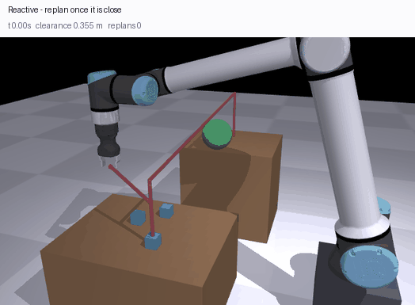
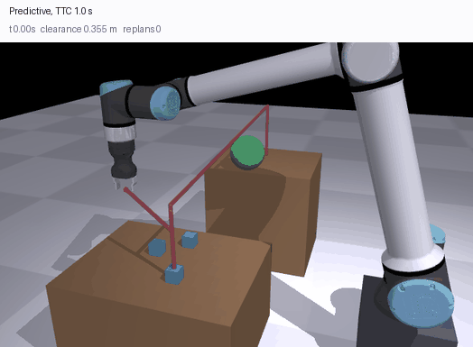

# reactive_replanning_ur12e

Reactive motion replanning for a UR12e + Robotiq Hand-E using a RealSense D435i for live obstacle detection. Built on ROS 2 Jazzy and MoveIt 2.

The arm runs a pick-and-place demo and routes around obstacles seen by the depth camera in real time. If a hand or other object enters the planned path mid-motion, the controller cancels cleanly, waits for the arm to settle, and re-plans from the current state.

## What's in here

```
launch/reactive_replanning_full.launch.py   # full stack: bringup + MoveIt + RViz + scene
config/reactive_replanning.rviz             # auto-loaded RViz with PointCloud2 + EEF path
config/sensors_3d.yaml                      # OctoMap point-cloud updater config
config/tuning.yaml                          # every parameter the node reads, with its default
reactive_replanning_ur12e/
  reactive_replanning.py                    # main detection + replanning node
  scene_setup.py                            # static collision objects (floor)
  insert_obstacle.py                        # CLI helper to drop a sphere mid-demo
```

## Detection pipeline

Each cloud frame from `/camera/camera/depth/color/points` is filtered in this order:

1. **Depth filter** in camera frame (`DEPTH_MIN`–`DEPTH_MAX` meters)
2. **Batch TF transform** to `base_link` using a single rotation matrix multiply
3. **Workspace bounding box** in `base_link` — drops floor, walls, robot pedestal, anything outside the working volume
4. **Color filter** — drops UR12e's palette (light gray / off-white housing, black accents, light-blue/teal trim) with a Kovac-rule skin protection so hands never get filtered
5. **Multi-link robot self-filter** — line-segment distance to every link shaft + joint-origin spheres + tool0 gripper guard, all dilated across the last 3 frames of arm motion (kills phantoms from points that get unmasked when the arm moves past)

Whatever survives is foreign. Centroid → published as a `CollisionObject` sphere on `/apply_planning_scene` so MoveIt can plan around it.

## Replanning strategy

Primary: `MoveGroup` action with pose constraints + `replan=True`, using **BITstar** (asymptotically optimal OMPL planner) with a 2.5 s budget for smooth, near-optimal paths.

During execution a monitor runs at 10 Hz:
- Reads `tool0` from TF (no FK service call)
- If the obstacle has *moved* since plan time AND any upcoming waypoint is within `SPHERE_RADIUS + PATH_CLEARANCE` of it, preempts the goal
- Cancels cleanly, polls joint velocities until the arm is at rest, then recursively replans from the new state (capped at depth 2)

Fallback chain when the primary plan can't be found:
1. `MoveGroup` retry after clearing the sphere (handles `START_STATE_IN_COLLISION`)
2. **IK redundancy**: ~120 IK solutions, sorted by joint distance from current state, plan up to 8 candidates and execute the shortest under the trajectory-length cap. Uses RRTConnect for speed.
3. Arc detour (cartesian over the obstacle) as last resort

## Visualization

The launch file points RViz at `config/reactive_replanning.rviz`, which loads on startup with:

- **RobotModel** — live joint state
- **PointCloud2** — `/camera/camera/depth/color/points` (Best Effort QoS so it actually displays)
- **PlannedEEFPath** — `nav_msgs/Path` republish of MoveIt's `/display_planned_path`, drawn as a green line tracing the tool0 path
- **Trajectory** — animated robot ghost following the planned trajectory with a trail
- **MotionPlanning** — full MoveIt panel for manual planning

The path republisher subscribes to `/display_planned_path`, FKs each subsampled waypoint to get tool0, and publishes on `/planned_eef_path`. Skipped during IK redundancy to avoid choking the FK service queue.

## Running

Three terminals.

**T1 — full stack:**
```bash
ros2 launch reactive_replanning_ur12e reactive_replanning_full.launch.py
```

**T2 — RealSense camera with point cloud:**
```bash
ros2 launch realsense2_camera rs_launch.py pointcloud.enable:=true
```

**T3 — the demo:**
```bash
ros2 run reactive_replanning_ur12e reactive_replanning
```

When prompted, press ENTER to start the cycles. Move your hand into the workspace at any time to trigger detection and a replan.

## Tuning

Everything is a ROS parameter. `config/tuning.yaml` carries the defaults and is
loaded by the launch file; the node runs identically without it, because the
class attributes it mirrors are the same values.

```bash
ros2 launch reactive_replanning_ur12e reactive_replanning.launch.py \
  params_file:=/path/to/my_cell.yaml

# or override one thing without a file
ros2 run reactive_replanning_ur12e reactive_replanning \
  --ros-args -p preempt_dist:=0.28 -p ws_z_min:=0.05
```

The pick and place poses are not coordinates. `compute_home_fk()` asks MoveIt
for the EEF pose at `HOME_JOINTS` and `_build_poses()` offsets it, so they
follow the robot rather than assuming where it is bolted down.

| Group | Parameters | What it controls |
|---|---|---|
| Task | `pick_z_offset`, `place_y_offset` | Where the pick and place sit relative to the home EEF pose |
| Planning | `ik_attempts`, `ik_pool_size`, `max_traj_length`, `short_path_eps`, `vel_scale`, `acc_scale` | Size of the IK redundancy search and how aggressively it settles for a short path |
| Camera | `depth_min`, `depth_max`, `cloud_throttle` | Depth gate in the optical frame, and how often frames are processed |
| Workspace | `ws_x_min/max`, `ws_y_min/max`, `ws_z_min/max` | The box in `base_link` that counts. **Re-measure these when the cell moves** — outside it is the pedestal, the floor and whoever is standing behind the robot |
| Self-filter | `use_color_filter`, `color_gray_sum`, `color_gray_diff`, `color_black_sum`, `arm_seg_radius`, `arm_joint_radius`, `eef_guard_radius`, `arm_link_pairs` | Telling the robot apart from everything else. The colour numbers are for this arm's housing under this lighting |
| Detection | `obstacle_threshold`, `debounce_frames`, `obstacle_ttl`, `obstacle_move_eps`, `sphere_radius` | How many surviving points count as an obstacle, and how long it persists |
| Reaction | `preempt_dist`, `warn_dist`, `path_clearance`, `decel_wait`, `max_replan_depth`, `detour_height` | When a motion is cancelled mid-execution and what happens next |

The self-filter geometry is still a hand-written capsule model rather than
something read out of the URDF — `arm_link_pairs` makes the chain configurable,
but the radii are two numbers for an arm whose links are not all the same
thickness. That is the next thing worth fixing here.

## Notes

- The `ur12e_hande_bringup` package is treated as read-only — none of its files are touched. All custom config lives in this package.
- OctoMap's `occupancy_map_monitor` plugin doesn't load on this MoveIt 2 Jazzy build. Direct point-cloud → `CollisionObject` injection is used instead, which gives MoveIt's planning scene the same information without depending on the broken plugin.
- Velocity scaling is intentionally conservative. The UR controller's max deceleration is what actually triggers protective stops on cancel — ramping deceleration limits in the URDF/controllers config is the way to soften that further.

---

# Predictive replanning, in MuJoCo

Everything above is Strategy 1 -- replan once the obstacle is already there. The
ME5250 write-up this repo grew out of lists Strategy 2 under future work:
*"implement time-to-collision estimation for moving obstacles, triggering
replanning before collision becomes imminent rather than after detection."*
This is that, plus the Strategy 3 the proposal also named, against an obstacle
that goes for the arm on purpose and reaches it every time.

It runs without ROS. The write-up records MuJoCo being tried first and dropped
over `ros2_control` segfaults and bridge timing; none of that applies here
because there is no bridge -- planner and controller share a process, and every
strategy is replayed against the same recorded obstacle motions.

## The result

Ninety recorded obstacle motions, every strategy replayed against the same ones.
The obstacle reaches the arm in all ninety if nothing gets out of the way, so
every trial is a real conflict rather than a coin flip about whether one
happened. Success is the cube on the place table **and** nothing touched.

| strategy | untouched | placed | success | mean clearance | replans | path / nominal |
|---|---|---|---|---|---|---|
| no replanning | 0/90 | 6/90 | 0/90 | −0.038 m | 0.0 | 1.00x |
| reactive | 4/90 | 11/90 | 2/90 | −0.033 m | 3.9 | 1.03x |
| predictive, TTC 0.5 s | 15/90 | 28/90 | 12/90 | −0.018 m | 4.2 | 1.18x |
| predictive, TTC 1.0 s | **37/90** | 17/90 | 13/90 | **+0.026 m** | 5.0 | 1.49x |
| local optimisation, TTC 0.5 s | 11/90 | 17/90 | 10/90 | −0.027 m | 4.1 | 1.24x |
| local optimisation, TTC 1.0 s | 31/90 | **35/90** | **25/90** | −0.005 m | 4.7 | 1.33x |

Paired on the same motions, by McNemar's exact test:

- **Reactive replanning is not distinguishable from doing nothing.** Success
  +2/−0 (p = 0.50), untouched +4/−0 (p = 0.12). Against an obstacle that is
  coming *at* the arm, waiting until it is 0.2 m away leaves no room to move.
  The report said as much qualitatively; this is the denominator behind it.
- **Predicting where it will be works.** Every predictive and optimising
  configuration beats the baseline on all three columns, none of them loses a
  single paired trial on avoidance, and the weakest p-value across those twelve
  comparisons is 7 × 10⁻³.
- **The best configuration is Strategy 3 with a one-second horizon**: 25/90
  successes against 0/90, p = 6 × 10⁻⁸, and it beats the single-point
  deformation at the same horizon on success (+17/−5, p = 0.017).
- **Horizon buys avoidance and spends the payload.** Predictive at 1.0 s is
  untouched 37 times to 15 at 0.5 s (+22/−0, p = 5 × 10⁻⁷) and places 17 times
  to 28. Its path is 1.49x nominal: it is dodging hard, and a hard dodge shakes
  a friction grasp. Spreading the same correction over every threatened
  waypoint, which is what Strategy 3 does, is how the 1.0 s horizon gets kept
  without the placements being paid for it.

Two things that are *not* the explanation, both checked rather than assumed.
Grip force: sweeping Robotiq's rated range, 20 N to 130 N (actuator gain 8 000
to 52 000), moves placement by one run in twelve. The payload speed bound:
1.10x, 1.20x and 1.35x are within a run of each other, because a tighter bound
clears less per replan and simply fires more of them. What loses the cube is the
shape of the deformation, not how hard the jaws squeeze or how fast the tool is
allowed to move.

## Six runs, one obstacle motion

All six are the same recorded motion, so the only difference is the strategy.
Grey is the plan before replanning, red is the plan the controller is actually
following; a deformation is the red path bending away from the grey.


Hit at −0.034 m. The obstacle arrives at the tool, and the cube ends up 0.84 m
from the target.


Fires twice once the obstacle is close, and is hit anyway at −0.025 m. Two
replans is not a small effort spent well; it is the whole budget spent late.


Three replans, clears by +0.086 m, places the cube 10.6 mm from target.


Same three replans, a second of lead instead of half: clears by +0.185 m, more
than twice the margin, and still places at 21.4 mm.


Two replans and hit at −0.022 m. Spreading a correction over the threatened
waypoints needs lead time to spread it over; half a second is not enough, which
is the aggregate result too (11/90 untouched against 31/90 at 1.0 s).


Clears by +0.082 m and places at 8.9 mm -- the tightest placement of the six.
This is the configuration the table picks.

## The obstacle goes for the arm

Earlier versions had it wander in a box near the workspace. It only sometimes
drifted into the path, so most trials posed no conflict at all and the
comparison largely measured how often the obstacle happened to be elsewhere. It
also gave the predictor nothing worth predicting: a mean-reverting wander has no
intent to estimate, so the filter's velocity carried almost no information about
where the obstacle would be when it mattered.

It now loiters clear of the arm, then closes on the tool path the arm follows
**if nothing replans**, solving the interception forwards at every step -- the
earliest future step whose recorded tool position is within reach at its closing
speed, aim there. Doing nothing is a collision by construction, and only
deviating escapes.

Getting from "sets off in roughly the right direction" to "arrives" took three
corrections, each found by measuring rather than by watching it:

- **It aimed at a commanded waypoint** while the controller lagged the command,
  and landed 0.11 to 0.16 m in front of the tool. It aims at the pose the
  simulator actually reached.
- **It chased the arm's current position.** A tail chase against a moving target
  arrives behind it, and about a third of the trials passed harmlessly astern.
  Leading the target is the whole difference: the error it steers on is now the
  distance to where the arm *will be* when it gets there.
- **It loitered wherever the standoff put it**, which on some draws was 3.6 cm
  from the tool at t = 0 -- already touching the robot before it set off, a
  collision no replanner could have avoided. Candidates are now drawn until one
  loiters clear of the arm's whole approach and above the benches.

Closest approach to the tool is 0.008 m median and 0.016 m worst against a
0.07 m sphere, and the do-nothing baseline is hit 90 times out of 90.

It is still random in the ways that matter to the predictor: where it loiters,
which direction it comes from, how far away it starts, how fast it closes, when
it sets off, and OU noise the whole way, so it neither travels a straight line
the tracker could extrapolate for free nor arrives exactly where it aimed. What
is no longer random is *whether there is anything to avoid*.

It also has to leave. Parking in the cell after the crossing turned the intruder
into furniture -- the arm came through the carry clean and then reversed into a
stationary sphere during the retreat. Carrying straight on sent it down through
the bench and the floor. Retracting to where it loitered took it back across the
corridor it had just crossed, so every trial posed the conflict twice and
avoidance halved across every strategy, which is a fact about the obstacle
rather than about replanning. It follows through on its incoming heading,
levelled so it never exits downwards, and that is one crossing.

Because it chases a *recorded* path it cannot react to a replan, so an arm that
moves early genuinely gets away rather than fighting an omniscient pursuer. A
test displaces the path by 25 cm along the direction the replanner pushes and
checks that every draw misses it.

## Three things the measurements were lying about

The first table this repo produced said replanning improved avoidance and hurt
the task. It was wrong three times over, and none of the three was visible in
the numbers -- each had to be found by checking a quantity against something
that already knew the answer.

**The clearance metric covered one collision geom out of eleven.** They were
selected with `endswith("_col")`. UR ships one collision mesh per link and the
loader splits meshes by material, so those geoms come out `<link>_col_0`; only
the Hand-E shell, a primitive, is a bare `hande_col`. That one matched. The
shoulder, forearm, both wrists and all four finger pads were invisible, and the
arm could be driven through the obstacle without the number moving.

**The simulator ran at a tenth of the rate everything else believed.** The
control loop stepped `mj_step` once per iteration at the model's 2 ms timestep
while the controller, the recorded obstacle and the clock all advanced 20 ms. The
arm was handed its next waypoint ten times too soon and lagged the command by up
to 0.64 rad, while the obstacle -- placed by mocap, so immune to the mismatch --
crossed the cell at ten times its stated speed. Stepping a whole control period
per iteration takes the tracking error to 0.035 rad mean, 0.19 worst.

**The planner thought the robot was a wire.** Its collision check is a point
skeleton and the points carried no thickness, so a plan that cleared the
obstacle by 2 cm of skeleton was four centimetres inside it. Over 4 000 random
poses and obstacle placements the skeleton overstated true surface-to-surface
clearance by 0.065 m on average and 0.28 m at worst. Each point now carries its
own link's shaft radius, read off the vendor collision meshes and re-derived from
the compiled model by a test; the same sample now *understates* clearance by
0.021 m on average, which is the direction a safety margin is supposed to err in.

That last one is the bug the ROS half of this repo still has, in a different
place: the self-filter's capsule model is "two numbers for an arm whose links
are not all the same thickness". The note calling that the next thing worth
fixing was written before this section existed.

## Collisions cost something

The obstacle used to be `contype="0"`. It swept through the arm and a collision
was only a number in a log: the run carried on undisturbed and the cube arrived
as though nothing had happened, so *avoided* and *hit* produced the same outcome
and no success rate could tell them apart.

It collides now. Being hit knocks the arm off its trajectory and the task fails
the way it would on hardware. That exposed a blind spot in the metric: with real
contact the obstacle knocks the carried cube straight out of the jaws without
going near a link, and in 8 runs of 30 the arm was clean, the cube was on the
floor, and the run scored as untouched. Clearance covers the cube while it is
held -- and "held" is checked against the simulator, not the plan, because the
plan believes it is carrying from the moment the jaws close, so a cube already on
the floor stayed in the metric and the obstacle drifting past it later scored as
a second collision with the arm nowhere near.

## The grasp is a grasp

The jaws open, close on the cube and hold it by friction. No weld, `neq == 0`,
and a test asserts it. Two things had to be true and neither was: every finger
geom was visual-only so the jaws passed through the cube, and open and closed
were inverted -- measured off the vendor meshes the jaw gap is exactly twice the
finger travel, so travel 0 is *closed*. Commands are derived from the object:
jaws touch a box of width `w` at travel `w/2`, open clears it by 8 mm, and the
grasp sits 2.5 mm inside each face against an actuator geared to Robotiq's rated
force. Left at a round gain the model produced 2.2 N against a rating of 20 to
185 N. It runs at 20 N, the bottom of that range, because the sweep above shows
the rest of the range does not buy anything.

## The tool is vertical, everywhere

IK was position-only, which is a modelling error rather than a simplification.
Minimum-norm steps move whichever joints are cheapest, so the shoulder did
nearly all the work, the elbow swung 0.27 rad against the shoulder's 0.93, and
wrist_3 never moved at all -- it cannot change a position, so a position-only
task gave it nothing to do. Nothing held the tool upright either: the gripper
reached the cube 36.6 degrees off vertical.

Every phase now commands a full pose and the trajectory is solved in task space,
because interpolating joint angles between two solved poses pinned the tool only
at the endpoints and let it swing 9.8 degrees off vertical in between. Tool tilt
is 0.043 degrees at worst across every waypoint of every rendered run. The
deformation holds it there too -- it used to push through a translational
Jacobian, which is free to rotate the wrist, and tilting a gripper mid-carry is
how a friction grasp drops what it is holding.

## No seeds

Every strategy is replayed against the same recorded obstacle motion, drawn from
the OS entropy pool. A seed only delivers a paired comparison as a side effect of
nothing else touching the generator in between, which is a property of the whole
program rather than of the experiment. A track is the motion itself, measurement
noise included. Tracks save and reload (`--save-tracks`, `--tracks`);
`tests/tracks/chase90.npz` is the batch the table was measured on and
`tests/tracks/demo.npz` is the single motion behind the six GIFs.

n = 30 is not enough here and was actively misleading: one batch of 30 put
Strategy 3 at 7/30 against predictive's 4/30 at the same horizon, and the sign of
that gap is the opposite of what 90 trials give. Everything above is n = 90.

## The cell is the vendor's

Meshes, masses and centres of mass from `Universal_Robots_ROS2_Description` at a
pinned commit, gripper from `robotiq_hande_description` -- the package this
repo's own xacro already includes. `assets/PROVENANCE.json` records a SHA-256 per
file. Two things that package settles: `config/ur12e/default_kinematics.yaml` is
byte-identical to `ur10e`, and `config/ur12e/visual_parameters.yaml` names
`meshes/ur10e/...` for every link. There is no `meshes/ur12e/` at all, so a UR12e
is a UR10e rated for more payload. `config/ur16e` differs, which is what makes
the identical files a statement about the robots rather than the repo. Meshes are
split by material, because a forearm binds four.

## Running it

```bash
uv venv --python 3.12 .venv
uv pip install --python .venv/bin/python mujoco numpy trimesh pycollada pyyaml pillow

git clone --depth 1 https://github.com/UniversalRobots/Universal_Robots_ROS2_Description.git third_party/ur_description
git clone --depth 1 https://github.com/AGH-CEAI/robotiq_hande_description.git third_party/hande_description
.venv/bin/python -m predictive_replanning.assets        # DAE/STL -> MuJoCo, with provenance

.venv/bin/python tests/test_predictive.py               # 67 checks
.venv/bin/python -m predictive_replanning.run --trials 90 --ttc 1.0 --tracks tests/tracks/chase90.npz
.venv/bin/python -m predictive_replanning.run --trials 90 --sweep-ttc 0.3,0.5,1.0,2.0 --tracks tests/tracks/chase90.npz
```

`--wander` swaps the intercepting obstacle for the box-confined one, which is
what the earlier tables were measured against.

Rendering needs a GL backend. On a headless box that is OSMesa, a **system**
package -- pip cannot supply it, and without it MuJoCo fails inside PyOpenGL with
`'NoneType' object has no attribute 'glGetError'`, an error naming neither MuJoCo
nor the missing library. On a bare image `apt-get update` has to run first or the
install simply does not find it:

```bash
apt-get update && apt-get install -y libosmesa6
```

`third_party/`, `assets/` and `.venv/` are gitignored -- derived or fetched, and
`assets/PROVENANCE.json` pins what they came from.

## What this is not

- **No perception.** The obstacle's position comes from the recorded track with
  Gaussian noise added. The RealSense pipeline above is not in this loop.
- **The planner's collision check is still a skeleton**, joint origins plus
  samples down each shaft to the TCP, now with a per-link radius. It runs over
  every future waypoint on every step, so it stays an approximation; the reported
  clearance uses the real meshes, and the planner is never scored on its own
  simplification.
- **The retiming is spatial only.** A deformation moves where the arm goes, not
  when it gets there, so the only way to buy clearance is to move further in the
  same time. Slowing down to let the obstacle pass is not in the search space,
  and it is the obvious next thing to add.
- **One cube.** The other two are scenery.
- **n = 90.** Enough to separate every strategy from the baseline and to order
  the two deformations at a one-second horizon; not enough to split 12 from 13.

## What is untouched

`reactive_replanning_ur12e/`, `config/`, `launch/`, `package.xml` and the
original detection tests are not modified by any of this. The only change outside
new files is one line in `setup.py` excluding this package from the ament build,
so `colcon build` does not pull MuJoCo into a ROS install.
